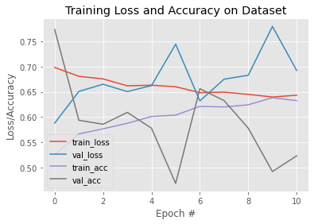

# FDA  Submission

**Paul Reiners**

**Algorithm for determining pneumonia from chest x-rays**

## Algorithm Description 

### 1. General Information

**Intended Use Statement:** 

This algorithm helps doctors to diagnose pneumonia from chest X-rays of patients.

**Indications for Use:**

Pneumonia is suspected in a patient.  This algorithm has been tested on and can be used on males and females of all ages who have been administered a chest X-ray.

**Device Limitations:**

The program must run on a GPU-enabled workspace.  The algorithm should not be used for patients over the age of 80 as it has not been trained or tested on such patients.

**Clinical Impact of Performance:**

Reduces time of verification of pneumonia diagnoses.  Runtime is well under a second per diagnosis.  Thus, the CNN is much faster than human doctors.

### 2. Algorithm Design and Function

<< Insert Algorithm Flowchart >>

**DICOM Checking Steps:**

Exploratory data analysis was used to spot-check the DICOM images.

**Preprocessing Steps:**

Pixel intensity was normalized to a mean of 0 and a standard deviation of 1.0.

**CNN Architecture:**

    Model: "sequential_2"
    _________________________________________________________________
    Layer (type)                 Output Shape              Param #   
    =================================================================
    model_1 (Model)              (None, 7, 7, 512)         14714688  
    _________________________________________________________________
    flatten_1 (Flatten)          (None, 25088)             0         
    _________________________________________________________________
    dropout_1 (Dropout)          (None, 25088)             0         
    _________________________________________________________________
    dense_1 (Dense)              (None, 1024)              25691136  
    _________________________________________________________________
    dropout_2 (Dropout)          (None, 1024)              0         
    _________________________________________________________________
    dense_2 (Dense)              (None, 512)               524800    
    _________________________________________________________________
    dropout_3 (Dropout)          (None, 512)               0         
    _________________________________________________________________
    dense_3 (Dense)              (None, 256)               131328    
    _________________________________________________________________
    dense_4 (Dense)              (None, 1)                 257       
    =================================================================
    Total params: 41,062,209
    Trainable params: 28,707,329
    Non-trainable params: 12,354,880
    _________________________________________________________________

### 3. Algorithm Training

**Parameters:**
* Types of augmentation used during training
    * horizontal_flip = True 
    * vertical_flip = False 
    * height_shift_range= 0.1 
    * width_shift_range=0.1
    * rotation_range=20 
    * shear_range = 0.1
    * zoom_range=0.1
* Batch size: 32
* Optimizer learning rate: 1e-4
* Layers of pre-existing architecture that were frozen: the first 17
* Layers of pre-existing architecture that were fine-tuned: last two layers
* Layers added to pre-existing architecture
    * flatten_2 (Flatten)         
    * dropout_4 (Dropout)              
    * dense_5 (Dense)              
    * dropout_5 (Dropout)        
    * dense_6 (Dense)    
    * dropout_6 (Dropout)         
    * dense_7 (Dense)    
    * dense_8 (Dense)       

<< Insert algorithm training performance visualization >> 

<< Insert P-R curve >>

**Final Threshold and Explanation:**

### 4. Databases
 (For the below, include visualizations as they are useful and relevant)

**Description of Training Dataset:** 

There is a total of 112,120 scans.  We split this into a training and validation set with an 80/20 split
and stratify on the pneumonia class.  The fraction of cases of pneumonia is then 0.0127 for both training and validation
data.  We know that we want our model to be trained on a set that has _equal_ proportions of pneumonia and no pneumonia, so we throw away some data.

We end up with 89,696 training scans.  Below is an example scan:

**Description of Validation Dataset:** 

The percentage patients with pneumonia in our data is 1%.  Thus, we want to have 1% of pneumonia cases in the validation set.  The validation set ends up with 224 scans of patients with pneumonia and 22,138 scans without pneumoniua. 

### 5. Ground Truth

The data is obtained from the NIH Chest X-ray Dataset.  The consensus labels of three U.S. board-certified radiologists (the majority of votes of three radiologists) were used as the reference standard of "ground truth".

### 6. FDA Validation Plan

**Patient Population Description for FDA Validation Dataset:**

The age range of the patient population was 0 (baby) to 94.  There were slightly more males than females in the population.

**Ground Truth Acquisition Methodology:**

The consensus labels of three U.S. board-certified radiologists (the majority of votes of three radiologists) were used as the reference standard of "ground truth".

**Algorithm Performance Standard:**

F1 Score is: 0.03076923076923077
