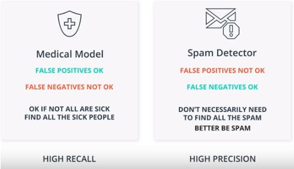

# FDA  Submission

**Paul Reiners**

**Algorithm for determining pneumonia from chest x-rays**

## Algorithm Description 

### 1. General Information

**Intended Use Statement:** 

This algorithm helps doctors to diagnose pneumonia from chest X-rays of patients.  Depending on the threshold setting for classification, it can be used either for screening or for accurate diagnosis.  A higher threshold of around 0.46 should be used for screening.  A lower threshold of 0.31 should be used for diagnosis where false negatives must be minimized. 

**Indications for Use:**

Pneumonia is suspected in a patient.  This algorithm has been tested on and can be used on people of all ages who have been administered a chest X-ray.  It can be used for emergency workflow re-prioritization.

**Device Limitations:**

The program must run on a GPU-enabled workspace either locally or, more likely, in the cloud.  The algorithm should not be used for patients over the age of 80 as it has not been trained or tested on such patients.

**Clinical Impact of Performance:**

Reduces time of verification of pneumonia diagnoses.  Runtime is well under a second per diagnosis.  Thus, the CNN is much faster than human doctors.

### 2. Algorithm Design and Function

**DICOM Checking Steps:**

Exploratory data analysis was used to spot-check the DICOM images.  We also check the following for each DICOM file:

* body part examined is 'CHEST' 
* modality is 'DX' 
* patient position is either 'AP' or 'PA'

**Preprocessing Steps:**

Pixel intensity was normalized.  We also did some augmentation of the training data.

**CNN Architecture:**

    Model: "sequential_2"
    _________________________________________________________________
    Layer (type)                 Output Shape              Param #   
    =================================================================
    model_1 (Model)              (None, 7, 7, 512)         14714688  
    _________________________________________________________________
    flatten_1 (Flatten)          (None, 25088)             0         
    _________________________________________________________________
    dropout_1 (Dropout)          (None, 25088)             0         
    _________________________________________________________________
    dense_1 (Dense)              (None, 1024)              25691136  
    _________________________________________________________________
    dropout_2 (Dropout)          (None, 1024)              0         
    _________________________________________________________________
    dense_2 (Dense)              (None, 512)               524800    
    _________________________________________________________________
    dropout_3 (Dropout)          (None, 512)               0         
    _________________________________________________________________
    dense_3 (Dense)              (None, 256)               131328    
    _________________________________________________________________
    dense_4 (Dense)              (None, 1)                 257       
    =================================================================
    Total params: 41,062,209
    Trainable params: 28,707,329
    Non-trainable params: 12,354,880
    _________________________________________________________________

### 3. Algorithm Training

**Parameters:**

* Types of augmentation used during training
    * horizontal_flip = True 
    * vertical_flip = False 
    * height_shift_range= 0.1 
    * width_shift_range=0.1
    * rotation_range=20 
    * shear_range = 0.1
    * zoom_range=0.1
* Batch size: 32
* Optimizer learning rate: 1e-4
* Layers of pre-existing architecture that were frozen: the first 17
* Layers of pre-existing architecture that were fine-tuned: last two layers
* Layers added to pre-existing architecture
    * flatten_2 (Flatten)         
    * dropout_4 (Dropout)              
    * dense_5 (Dense)              
    * dropout_5 (Dropout)        
    * dense_6 (Dense)    
    * dropout_6 (Dropout)         
    * dense_7 (Dense)    
    * dense_8 (Dense)       

We can see that the training loss decreased over the epochs, while the validation loss tended to go up with some spikes.

**Final Threshold and Explanation:**

We used a classification threshold of 0.4646464646464647.

### 4. Databases

**Description of Training Dataset:** 

There is a total of 112,120 scans.  We split this into a training and validation set with an 80/20 split
and stratify on the pneumonia class.  The fraction of cases of pneumonia is then 0.0127 for both training and validation
data.  We know that we want our model to be trained on a set that has _equal_ proportions of pneumonia and no pneumonia, so we throw away some data.

We end up with 89,696 training scans.  Below is an example scan:

**Description of Validation Dataset:** 

We construct 20%/80% split of pneumonia/non-pneumonia cases in the validation set.  

    pneumonia count:      286
    non-pneumonia count: 1144
    pneumonia %:           20

### 5. Ground Truth

The data is obtained from the NIH Chest X-ray Dataset.  The consensus labels of three U.S. board-certified radiologists (the majority of votes of three radiologists) were used as the reference standard of "ground truth".

### 6. FDA Validation Plan

**Patient Population Description for FDA Validation Dataset:**
    
The ideal data set to receive from a clinical partner for FDA validation would meet the following requirements:

* body part examined: 'CHEST' 
* modality: 'DX' 
* patient position: 'AP' or 'PA'
* age range: 0 to 80 years
* gender distribution: balanced
* prevalence of pneumonia (and other diseases): 20%

**Ground Truth Acquisition Methodology:**

The consensus labels of three U.S. board-certified radiologists (the majority of votes of three radiologists) were used as the reference standard of "ground truth".

**Algorithm Performance Standard:**

Minimum acceptable F1-score should be 0.387 because I found in the [CheXNet paper](https://stanfordmlgroup.github.io/projects/chexnet/) that that is the average radiologist F1-score.

F1 Score is 0.40.  The confusion matrix is

    [[75 26]
     [14 13]]
     
There were 128 validation cases.  Out of these, 26 were false positives and 14 were false negatives.  The false positives are less worrisome than the false negatives, because it is better to err on the side of caution.  At any rate, all findings of the algorithm should be verified by a board-certified radiologist.

To see whether we can drive down the frequency of false negatives, we will try using an F-beta score. To minimize the number of false negatives, we need to maximize recall.

By lowering the threshold to 0.31313131313131315, we can decrease the number of false negatives to only 3.
